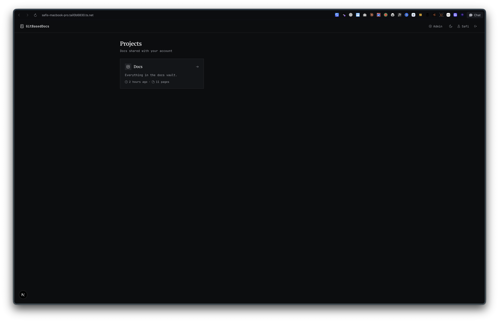

# GitBasedDocs

Private docs sites built from the Markdown in one GitHub repo.

<p align="center">
  <a href="https://nextjs.org"></a>
  <a href="https://react.dev"></a>
  <a href="https://orm.drizzle.team"></a>
  <a href="https://next-auth.js.org"></a>
  <a href="https://github.com/Abdulkader-Safi/GitBasedDocs/commits/main"></a>
  <a href="LICENSE"></a>
</p>


You write in Obsidian or any other editor and push to GitHub. A few seconds later the pages are live for the people you gave access to. Nothing is public, and each person sees only the projects an admin shared with them.

## How it works

1. The app watches one GitHub repo and reads it with a fine-grained token that only the server holds. The content repo needs no GitHub Actions and no workflow files.
2. Each project is a folder in that repo, or the whole repo. Every Markdown file inside becomes a page.
3. On a push, GitHub calls a webhook and the app fetches only the files whose blob sha changed. Without the webhook it checks for new commits every 10 minutes. Admins can also press Sync now.
4. Pages, search text and images live in the app's database and asset folder. Reading a page never calls GitHub.
5. Anyone who opens a project they have no access to gets "Page not found", the same answer as for a project that does not exist. Project names never leak through a 403.

## Screenshots

Readers land on the projects shared with their account.



The admin overview shows connection health and the latest sync runs, plus counts of users and of denied page opens.


## What you get

- A sidebar built from your folders. A folder's `index.md` opens when you click the folder, and the folder keeps its real name.
- Search inside a project on `Cmd+K` / `Ctrl+K`, with recent pages when the box is empty.
- The Markdown syntax Obsidian and GitHub both know: Shiki code highlighting with titles, line marks and diffs, Mermaid diagrams, KaTeX math, callouts with folding, wikilinks and image embeds. `%%hidden comments%%` never reach the page.
- A header on every page with who changed it last. Admins also see the commit id and a link to the file on GitHub.
- Three roles. Admins run everything. Editors read like viewers but also see pages marked `draft: true`. Viewers read the projects linked to them.
- An access log of page opens and denied attempts, and an audit line for every danger zone action (each one needs a typed confirm).
- Light and dark themes, three page widths, and a layout that works on a phone.

## Run it

The app lives in `dashboard/`. Run every command from there. It uses [Bun](https://bun.sh).

```bash
cd dashboard
cp .env.example .env   # set NEXTAUTH_SECRET, GITHUB_TOKEN, ADMIN_EMAIL, ADMIN_PASSWORD
bun install
bun run dev            # http://localhost:3000
```

Sign in with `ADMIN_EMAIL` and `ADMIN_PASSWORD`. The app creates that account on the first login while the users table is empty and asks for a new password right away. Then link your repo on the Admin Connection page.

The GitHub token needs read-only access to Contents and Metadata on the content repo, nothing else.

[`dashboard/README.md`](dashboard/README.md) has the full list of environment variables, the deploy notes and the webhook setup. Short version for deploy: run a single instance, put `dashboard/data/` on a persistent volume, and put a TLS proxy in front. Migrations run on the first database call after boot. Postgres is not supported yet.

## Checks

There is no test runner. Each logic unit has a runnable `*.check.ts` next to it (list in `dashboard/README.md`), and the final gate is:

```bash
bun run lint && bun run typecheck && bun run build
```

## License

MIT. See [LICENSE](LICENSE).
